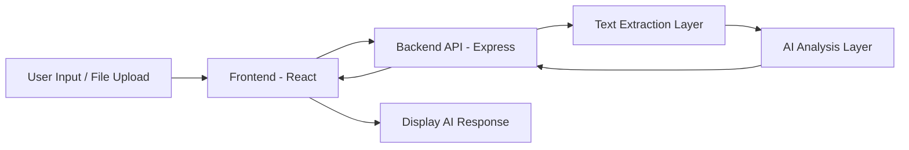

# 🚀 Social Media Content Analyzer

A full-stack web application that analyzes social media posts and uploaded documents to generate structured engagement feedback, performance scoring, improvement suggestions, and relevant hashtags.

The application supports direct text input as well as PDF and image uploads (with OCR support). Extracted content is processed through an AI analysis layer and returned in a clean, readable format.

---

## Live Demo

**Frontend (Vercel):**  
https://social-media-content-analyzer-r339bpl36.vercel.app/

**Backend (Render):**  
https://social-media-content-analyzer-backendd.onrender.com

---

## ✨ Features

- Text-based post analysis  
- PDF text extraction  
- Image OCR text extraction  
- Engagement score (out of 10)  
- Improvement suggestions  
- Relevant hashtag recommendations  
- Loading indicators for better UX  
- Basic error handling  
- Clean light-themed responsive UI  
- Production-ready deployment  

---

## 🏗 Architecture Overview

The application follows a clean client-server architecture.

### Frontend
- Handles UI rendering
- Accepts text input
- Uploads files (PDF / Image)
- Sends requests to backend API
- Displays AI-generated response

### Backend
- Exposes REST API endpoints
- Handles file uploads
- Extracts text from PDFs
- Performs OCR on image files
- Sends extracted content to AI analysis service
- Returns structured response to frontend

---

## 🔄 Application Flow



### Step-by-Step Flow

1. User enters text or uploads a file  
2. Frontend sends request to backend  
3. Backend extracts text (PDF parsing or OCR)  
4. Extracted content is sent to AI service  
5. AI generates engagement insights  
6. Backend returns response  
7. Frontend displays formatted result  

---

## 📁 Folder Structure

```
social-media-content-analyzer/
│
├── backend/
│   ├── uploads/              # Temporary uploaded files
│   ├── server.js             # Express server entry point
│   ├── package.json
│   └── .env                  # Environment variables (not committed)
│
├── frontend/
│   ├── public/
│   ├── src/
│   │   ├── assets/
│   │   ├── components/
│   │   ├── pages/
│   │   │   ├── Home.jsx
│   │   │   └── Analyze.jsx
│   │   ├── App.jsx
│   │   └── main.jsx
│   ├── index.html
│   ├── package.json
│   └── .env
│
└── README.md
```

---

## 🛠 Tech Stack

### Frontend
- React  
- Vite  
- Tailwind CSS  
- Axios  

### Backend
- Node.js  
- Express  
- Multer  
- pdf-parse  
- Tesseract.js  

### Deployment
- Vercel (Frontend)  
- Render (Backend)  

---

## ⚙️ Environment Variables

### Backend (.env)

```
PORT=5000
API_KEY={your_api_key_here}
```

### Frontend (.env)

```
VITE_API_URL={your_backend_url}
```

---

## 💻 Run Locally

### 1️⃣ Clone Repository

```bash
git clone https://github.com/PranavGoel26/social-media-content-analyzer.git
cd social-media-content-analyzer
```

---

### 2️⃣ Setup Backend

```bash
cd backend
npm install
npm start
```

Backend runs at:

```
http://localhost:5000
```

---

### 3️⃣ Setup Frontend

```bash
cd frontend
npm install
npm run dev
```

Frontend runs at:

```
http://localhost:5173
```

##  Evaluation Highlights

- Clean and modular project structure  
- Proper error handling  
- Loading states for better UX  
- File upload with OCR support  
- Production deployment setup  
- Clear separation of concerns  

---

##  Author

**PRANAV GOEL**
